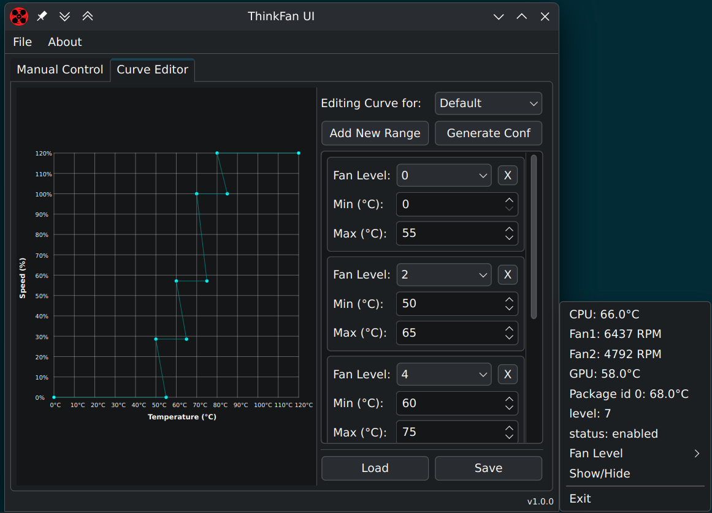
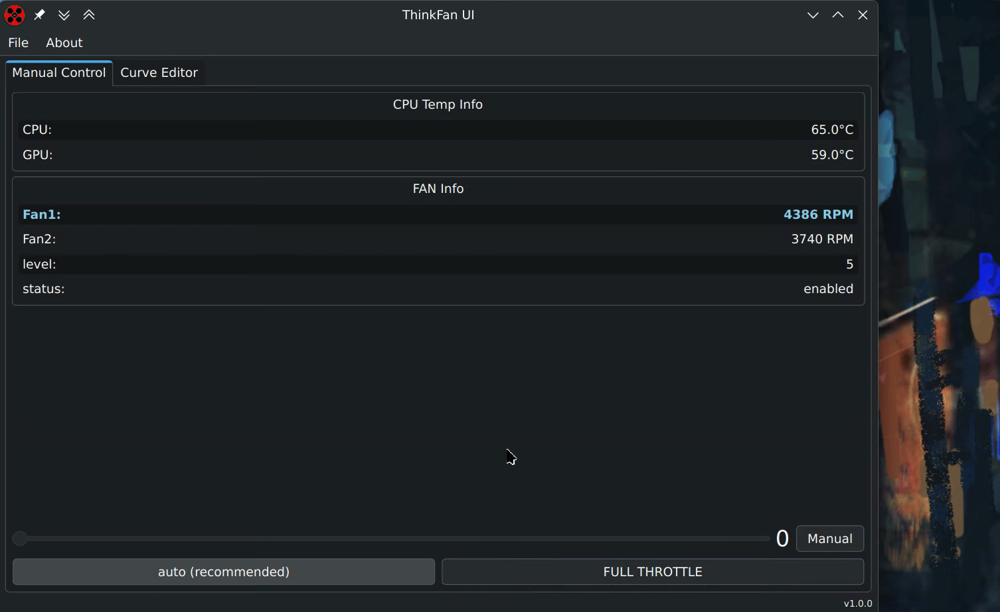

#  Thinkfan UI

Small and simple application for controlling fan speed on IBM/Lenovo ThinkPads,
it can also monitor CPU temp and fan RPM.




This is a complete rewrite of the previous code using **PyQt6**.

It is written for **Linux only**. For Windows, see [speedfan](http://www.almico.com/speedfan.php).

## How it Works?

- Parses `sensors` command to show CPU temp
- Modifies `/proc/acpi/ibm/fan` to change fan speed

## CLI Arguments

- `--no-tray` disables tray icon
- `--hide` hides main window on start

## Dependencies

### Debian / Ubuntu
`sudo apt install lm-sensors policykit-1 python3 python3-pyqt6 python3-yaml`

### Fedora
`sudo dnf install lm_sensors polkit python3 python3-pyqt6 python3-pyyaml`

## Install

### Arch / Manjaro

AUR: [thinkfan-ui](https://aur.archlinux.org/packages/thinkfan-ui/)

### Debian / Ubuntu

- Download `.deb` from [release page](https://github.com/zocker-160/thinkfan-ui/releases)
- Install using package manager of your choice or in terminal with `apt install ./<packagename>.deb`

### Manual

- Install all required dependencies
- Open this file, using command -- `sudo nano /etc/modprobe.d/thinkpad_acpi.conf`
- Add line `options thinkpad_acpi fan_control=1`
- Reboot
- Clone this repository and navigate to the `src` folder
- Run `python3 main.py`

# Thinkfan Conf 
### Simple vs Detailed syntax logic

1. `generated_simple.conf` (_Simple Syntax_)
``` c# 
fans:
  - tpacpi: /proc/acpi/ibm/fan

sensors:
  - hwmon: /sys/class/hwmon
    name: thinkpad
    indices: [1, 2]
    # Mappings for thinkpad:
    #   1: CPU
    #   2: GPU

  - hwmon: /sys/class/hwmon
    name: coretemp
    indices: [1]
    # Mappings for coretemp:
    #   1: Package id 0

levels:
  - [0, 0, 50]
  - [1, 45, 55]
  - [2, 50, 60]
  - [3, 55, 65]
  - [4, 60, 70]
  - [5, 65, 75]
  - [6, 70, 80]
  - [7, 75, 85]
  # Using 127, the verified numerical equivalent for "full-speed".
  - [127, 80, 100]
```
- **Logic**: The fan speed is controlled by the single hottest sensor.

- **Scenario**: If the `thinkpad CPU` sensor is at **78°C** and all other sensors are at **50°C**, thinkfan will use **78°C** as its only reference. The fan will be set to **level 7**, ignoring the cooler sensors completely.

2. `generated_detailed.conf` (_Detailed Syntax_)
``` c
fans:
  - tpacpi: /proc/acpi/ibm/fan

sensors:
  - hwmon: /sys/class/hwmon
    name: thinkpad
    indices: [1, 2]
    # Mappings for thinkpad:
    #   1: CPU
    #   2: GPU

  - hwmon: /sys/class/hwmon
    name: coretemp
    indices: [1]
    # Mappings for coretemp:
    #   1: Package id 0

levels:
  - speed: 0
    lower_limit: [0, 0, 0]
    upper_limit: [55, 55, 55]
  - speed: 2
    lower_limit: [50, 50, 50]
    upper_limit: [65, 65, 65]
  - speed: 4
    lower_limit: [60, 60, 60]
    upper_limit: [75, 75, 75]
  - speed: 7
    lower_limit: [70, 70, 70]
    upper_limit: [85, 85, 85]
  - speed: 127
    lower_limit: [80, 80, 80]
    upper_limit: [100, 100, 100]

```

- **Logic**: To increase fan speed, all three sensors must agree by crossing their individual temperature thresholds for the next level.

- **Scenario**: If the `coretemp` sensor is at **62°C** but the `thinkpad GPU` is at **58°C**, the fan will not speed up to a level that requires all sensors to be above **60°C**. The cooler `GPU` prevents the fan from speeding up.

---

Note: You are required to have the Linux kernel with `thinkpad-acpi` patch. (Ubuntu, Solus and a few others already seem to have this)
