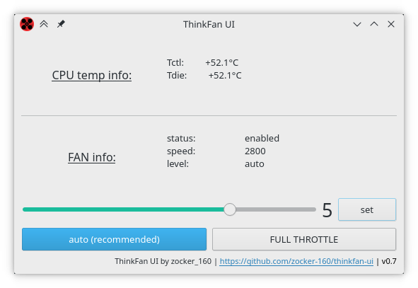

#  Thinkfan UI

This is a complete rewrite of [scientifichackers/thinkfan-control-gui](https://github.com/scientifichackers/thinkfan-control-gui) using PyQt5.

This is an application for controlling fan speed on IBM/Lenovo ThinkPads.

It can also monitor CPU temp and fan RPM.

It is written for **Linux only**. For Windows, see http://www.almico.com/speedfan.php   

## How it Works?

+ Parses `sensors` command to show CPU temp
+ Modifies `/proc/acpi/ibm/fan` to change fan speed

## Dependencies

`sudo apt install lm-sensors python3 python3-pyqt5`

## Install

### Arch / Manjaro

Package is available in the AUR: [thinkfan-ui](https://aur.archlinux.org/packages/thinkfan-ui/)

### Debian / Ubuntu

- Download `.deb` from [release page](https://github.com/zocker-160/thinkfan-ui/releases)
- Install using package manager of your choice or in terminal with `gdebi <packagename>.deb`

### Manual

- Open this file, using command -- `sudo nano /etc/modprobe.d/thinkpad_acpi.conf` 
- Add line `options thinkpad_acpi fan_control=1`
- Reboot
- clone this repository and navigate to the `src` folder
- `python3 fan.py` (add `sudo` to modify speed)

---

Note: You are required to have the Linux kernel with `thinkpad-acpi` patch. (Ubuntu, Solus and a few others already seem to have this)
